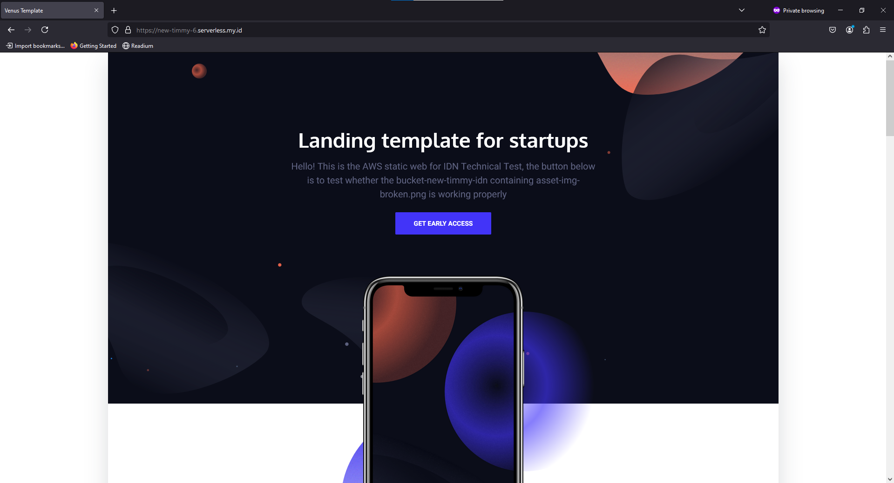
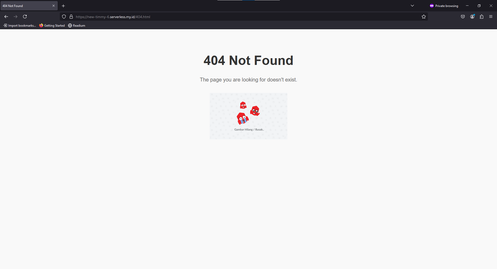

# Web Static for IDN Technical Test

This repository contains the web static content for the IDN Technical Test. You can view the result at [new-timmy-6.serverless.my.id](http://new-timmy-6.serverless.my.id).

## Screenshots of the Result

### 1. Main Page (Using origin `idn-new-timmy-6` bucket)



### 2. Second Page (Using origin `bucket-new-timmy-idn` bucket)



## Instructions

To replicate this setup locally, follow the steps below:

1. **Open the live result**: 
   - Visit [new-timmy-6.serverless.my.id](http://new-timmy-6.serverless.my.id) to see the deployed static website.
   - You can click the **'GET EARLY ACCESS'** button on the homepage. This button will test if the **`bucket-new-timmy-idn`** containing `asset-img-broken.png` is working properly.

2. **Setup your local environment**:
   - Ensure you have Terraform installed.
   - Clone this repository to your local machine.

3. **Ignore the providers.tf file**:
   - The `.gitignore` file includes the path `./terraform-config-script/providers.tf` to prevent committing your sensitive provider configuration.
   
4. **Create a `providers.tf` file**:
   - Inside the directory `./terraform-config-script/`, create a file called `providers.tf`.
   - Add the following code to your `providers.tf` file and replace `"YOUR_KEY"` and `"YOUR_SECRET_KEY"` with your AWS credentials:

   ```hcl
   provider "aws" {
     region     = var.region
     access_key = "YOUR_KEY"
     secret_key = "YOUR_SECRET_KEY"
   }

